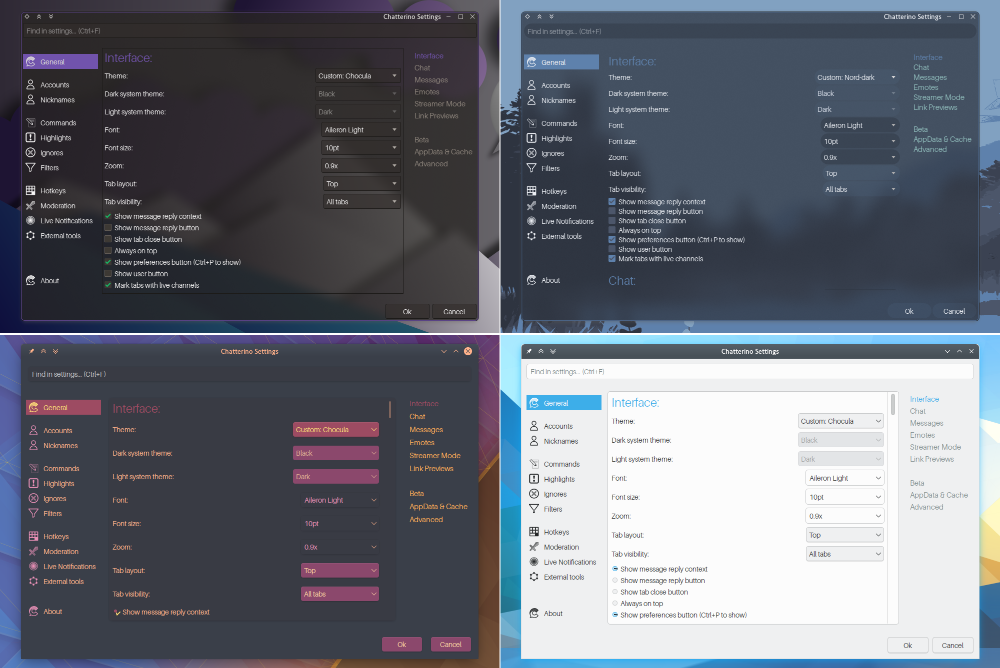
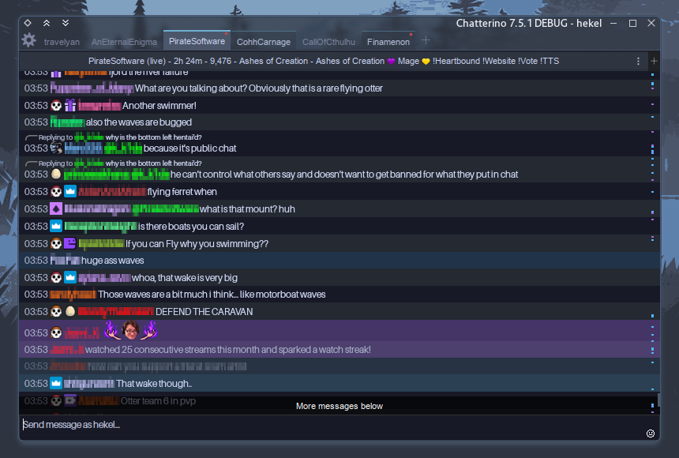

# chatterino-stuffs
-------------------
## Chatterino Native QT Patches
By default Chatterino is hardcoded to use the Fusion QT Style with a custom stylesheet enforcing a dark grey theme that doesn't integrate well with other QT apps.

These patches are based against [Chatterino7](https://github.com/SevenTV/chatterino7) and tested with [Chatterino2](https://github.com/Chatterino/chatterino2), though they *should* work with most Chatterino2 forks.

They're intended to force Chatterino to use your native system-wide QT Style and introduce minor quality-of-life tweaks to ensure consistency across various themes and color schemes.

### Y Tho?
Some QT Styles like the [Kvantum](https://github.com/tsujan/Kvantum) theming engine or [Lightly](https://github.com/Luwx/Lightly) support transparent windows. This allows us to use [transparency in Chatterino themes](/Themes).

# Installation
## Arch Linux
[chatterino2-7tv-native-git](https://aur.archlinux.org/packages/chatterino2-7tv-native-git) is available in the [Arch User Repository](https://aur.archlinux.org/)