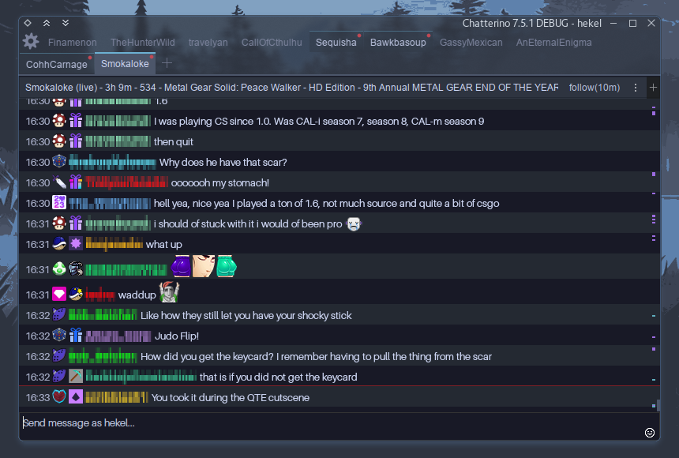

# Chatterino2 Themes
Here are a few themes I've created to help integrate Chatterino with some of my favorite KDE/QT themes.

### Transparency
These themes support transparent tabs when used in conjunction with transparent [Kvantum](https://github.com/tsujan/Kvantum) themes. Transparency may also work with [Lightly](https://github.com/boehs/Lightly)/[Darkly](https://github.com/Bali10050/Darkly) when using an appropriate transparent/glassy color scheme but I haven't tested this as of yet.

However Chatterino is hardcoded to use QT's Fusion style and it must be patched in order to [use your system's native QT style engine.](https://github.com/hekel/chatterino-stuffs)

#### Note: Since Chatterino/chatterino2#6137 window background transparency is forced on Linux, affecting the Kv/QT transparency method we relied on. These themes may no longer look as intended. I'll update these as I have time.

## Chocula
Designed to compliment the [Chocula Desktop Theme](https://github.com/SueDonham/chocula-desktop-theme); a chocolaty spin on the popular [Dracula Theme](https://github.com/dracula/gtk)


## Nord
Designed with [Utterly Nord](https://github.com/HimDek/Utterly-Nord-Plasma) in mind, this theme should feel at home with most dark [Nord](https://www.nordtheme.com/) inspired themes  

  

## Nord Dark
Designed with [Utterly Nord](https://github.com/HimDek/Utterly-Nord-Plasma) in mind, this theme should feel at home with most dark [Nord](https://www.nordtheme.com/) inspired themes  



# Installation
These themes can be installed by placing any of the JSON files into your chatterino themes folder and restarting Chatterino:
```
~/.local/share/chatterino/Themes
```